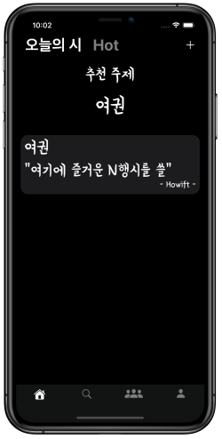
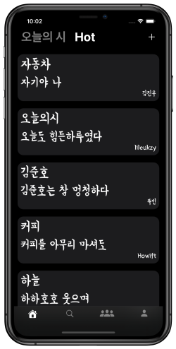
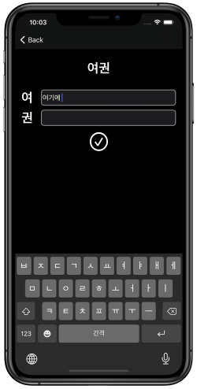
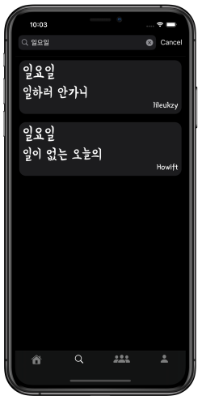
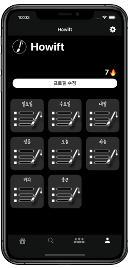

재미있고 의미있는 N행시를 많은 사람들과 나누어 보아요!

## 목차

- [화면](#screen-shot)
- [앱 기능](#app-features)
- [사용한 기술](#app-technologies)
- [업데이트](#app-updates)

## <a name="screen-shot">화면</a>

## <a name="app-features">앱 기능</a>

- Email / password를 통한 회원가입, 로그인 기능 (Firebase Auth)
- N행시 작성 및 좋아요, 인기 있는 N행시 확인 (Firebase FireStore)
- 작성된 N행시를 주제를 기준으로 검색 (UISearchController)
- 특수문자 사용 불가 (CharacterSet)
- 오늘의 시 / 인기있는 시 (UITableView)
- 유저 프로필 확인 (UICollectionView)
- 라이트 모드 / 다크 모드 가능

## <a name="app-technologies">사용한 기술</a>

- 코드로 UI 작성 (No Storyboard)
- 최근 MVVM 디자인 패턴을 공부하며 조금씩 적용해 나가는 중 (RxSwift)
- 데이터 베이스와 인증 기능은 Firebase 사용 (Firebase)
- Fireabse는 Swift Package Manager 사용 (SPM)
- RxSwift는 CocoaPods 사용 (CocoaPods)

## <a name="app-updates">업데이트</a>

- 1.2.4 ✅
- 1.2.1 ✅  [Detail](https://github.com/elddy0948/NLetterPoem/wiki/NLP1.2)
- 출시 ✅ [Detail](https://github.com/elddy0948/NLetterPoem/wiki/출시!)
